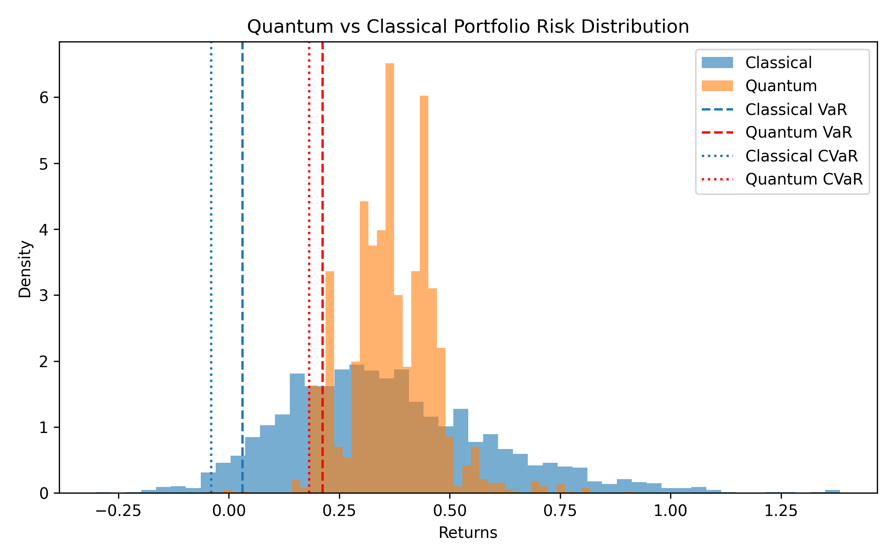
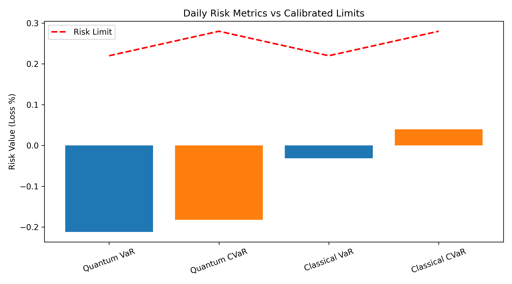
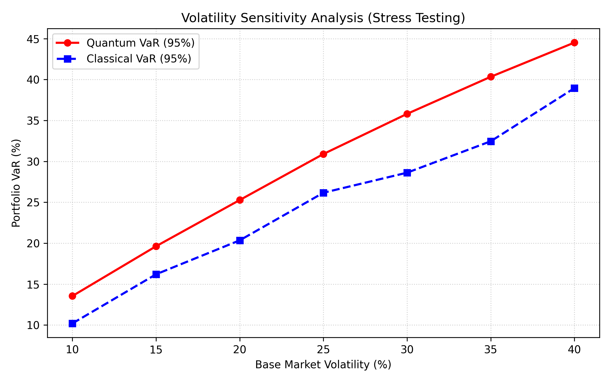
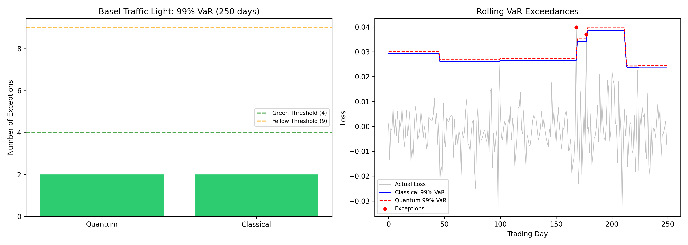

# Quantum Monte Carlo Market Risk System

### A Research-Oriented Hybrid Quantum-Classical Portfolio Risk Platform

[](https://python.org)
[](https://pennylane.ai)
[](https://fastapi.tiangolo.com)
[](https://streamlit.io)
[](https://docker.com)
[](LICENSE)

**Combining quantum computing with regulatory-style financial risk analytics**

[Overview](#overview) · [Architecture](#architecture) · [Features](#features) · [Quickstart](#quickstart) · [Dashboard](#dashboard) · [Theory](#theory) · [Results](#results)

</div>

---

## Key Takeaways
- **Hybrid Architecture:** Integrates a Parameterized Quantum Circuit (PQC) into a classic FastAPI/Streamlit Monte Carlo pipeline.
- **Regulatory Alignment:** Implements 99% VaR rolling out-of-sample backtesting matching Basel traffic light specifications.
- **Risk Attribution:** Decomposes risk using Marginal VaR and Component VaR to identify individual asset contributions.
- **Research Focus:** Evaluates NISQ depolarizing noise and discusses Quantum Amplitude Estimation (QAE) limits.
- **Dynamic Stress Testing:** Analyzes portfolio sensitivity across systematic volatility shocks from 10% to 40%.

---

## Overview

The **Quantum Monte Carlo Market Risk System (QMCMRS)** is a full-stack, production-style hybrid quantum-classical platform for estimating portfolio **Value-at-Risk (VaR)** and **Conditional Value-at-Risk (CVaR)**. It demonstrates how quantum computing can integrate into a real banking risk infrastructure — not as a replacement for classical systems, but as an alternative scenario generation framework.

> **"Can quantum sampling integrate into existing Monte Carlo risk workflows?"**
> This project answers that question with a working, runnable system.

### The Problem

Every day, banks and asset managers must compute **VaR** — the maximum expected loss in a bad market day. For a multi-asset portfolio, this requires:
1. Generating thousands of correlated market scenarios
2. Simulating portfolio losses across all scenarios
3. Extracting tail-risk statistics (VaR, CVaR)
4. Validating the model against history (Basel backtesting)
5. Flagging when risk limits are breached

Classical systems do this with pseudo-random number generators. **This project replaces step 1 with a Parameterized Quantum Circuit (PQC)** and compares the results side-by-side.

---

## Architecture

```
┌─────────────────────────────────────────────────────────────┐
│                    Streamlit Dashboard                       │
│         (VaR · CVaR · Risk Attribution · Basel Status)       │
└───────────────────────────┬─────────────────────────────────┘
                            │  REST API (JSON)
┌───────────────────────────▼─────────────────────────────────┐
│                   FastAPI Backend                            │
│         Background Tasks · SQLite Audit Log                  │
└───────────────────────────┬─────────────────────────────────┘
                            │  In-Process
┌───────────────────────────▼─────────────────────────────────┐
│                    Risk Engine (src/)                        │
│                                                             │
│  ┌─────────────────────┐    ┌─────────────────────────────┐ │
│  │  Quantum Engine      │    │  Classical Engine           │ │
│  │  PQC + CNOT          │    │  Multivariate Normal /      │ │
│  │  Entanglement        │    │  Student-t                  │ │
│  │  PennyLane           │    │  NumPy                      │ │
│  └──────────┬──────────┘    └────────────┬────────────────┘ │
│             │  Cholesky Decomposition     │                  │
│             └──────────────┬─────────────┘                  │
│                            ▼                                 │
│         Correlated Portfolio Scenario Returns                │
│                            │                                 │
│   ┌────────────┬───────────┴──────────────┬──────────────┐  │
│   │ VaR/CVaR   │  Marginal VaR /          │  Rolling     │  │
│   │ (95%, 99%) │  Component VaR           │  Backtester  │  │
│   │ L-VaR      │  Risk Attribution        │  Basel TL    │  │
│   └────────────┴──────────────────────────┴──────────────┘  │
└─────────────────────────────────────────────────────────────┘
                            │
                     SQLite Database
                  (Execution Audit Log)
```

| Layer | Component | Technology |
|---|---|---|
| **Quantum Sampler** | PQC with Hadamard + RY + CNOT ansatz | PennyLane |
| **Correlation** | Cholesky Decomposition on historical covariance | NumPy / SciPy |
| **Risk Metrics** | VaR, CVaR, L-VaR (engine helper), Marginal VaR, Component VaR | NumPy / SciPy |
| **Backtesting** | 250-day rolling out-of-sample, Basel Traffic Lights | yfinance / NumPy |
| **Persistence** | Execution logs and backtest history | SQLite |
| **API** | Async REST endpoints with Background Tasks | FastAPI + Uvicorn |
| **Dashboard** | Interactive multi-tab risk viewer | Streamlit |
| **Deployment** | Single-command containerised deployment | Docker |

---

## Features

### Quantum
- **Parameterized Quantum Circuit (PQC)** — Hadamard superposition + learnable RY rotations + CNOT entanglement layers across asset registers
- **PQC Calibration** — Rotation parameters (θ) calibrated using a simplified noise injection process to introduce variance (with a full variational training loop using PennyLane's Adam Optimizer detailed as future work)
- **NISQ Noise Simulation** — Optional `default.mixed` backend with configurable Depolarizing Channel error rates

### Quantitative Finance
- **Correct Portfolio Correlation** — Cholesky Decomposition (L Lᵀ = Σ) ensures exact target correlations between all assets — no more perfect-correlation assumption
- **Fat-Tailed Returns** — Configurable Student-t distribution (df=4) for realistic tail risk beyond Gaussian assumptions
- **Multi-Metric Risk** — VaR (95% and 99%) and CVaR calculations, with a helper implementation of **Liquidity-Adjusted VaR (L-VaR)** available in the engine codebase
- **Risk Attribution** — **Marginal VaR** and **Component VaR** per asset, showing exactly which holding drives portfolio risk
- **Stress Testing** — Volatility sensitivity grid (10%–40%) for both quantum and classical engines

### Regulatory & Backtesting
- **Rolling Out-of-Sample Backtesting** — 250-day rolling window comparing forecasted 99% VaR to actual realized losses
- **Basel Traffic Light System** — Green (≤4 exceptions) / Yellow (5–9) / Red (≥10) classification per Basel II/III standards
- **Risk Limit Governance** — PASS / WARNING / BREACH status flags for VaR and CVaR against calibrated thresholds
- **Full Audit Trail** — Every execution logged to SQLite with timestamp, mode, and risk metrics

### Engineering
- **In-Process Execution** — No subprocesses; engine runs directly inside the FastAPI worker for performance and thread safety
- **Async Background Tasks** — Heavy simulations triggered as background jobs; API returns immediately
- **yfinance Integration** — Pulls real historical returns for SPY, AAPL, GLD; gracefully falls back to a realistic multivariate mock generator if offline
- **Docker Deployment** — Single `docker compose up --build` spins up the entire platform
- **Pytest Suite** — Unit tests for VaR/CVaR, Liquidity-VaR, Cholesky correctness, and quantum engine shape

---

## Project Structure

```
Quantum Monte Carlo Market Risk System/
│
├── src/                            # Core risk engine
│   ├── engine/                     # Modular engine library
│   │   ├── config.py               # All parameters (assets, qubits, limits)
│   │   ├── quantum_engine.py       # PQC, CNOT entanglement, Cholesky mapping
│   │   ├── risk_metrics.py         # VaR, CVaR, L-VaR, Marginal VaR
│   │   ├── backtester.py           # yfinance data + Basel traffic lights
│   │   └── database.py             # SQLite persistence
│   ├── scenario_portfolio_risk.py  # Entrypoint: simulation + distribution plots
│   ├── risk_limits.py              # Entrypoint: governance check + plots
│   └── backtesting.py              # Entrypoint: rolling backtest + plots
│
├── backend/                        # FastAPI REST API
│   ├── app.py                      # App factory + router registration
│   ├── runner.py                   # In-process pipeline executor
│   ├── config.py                   # Path configuration
│   ├── schemas.py                  # Pydantic response models
│   └── routes/
│       ├── health.py               # GET /health
│       ├── run.py                  # POST /run (Background Task)
│       ├── results.py              # GET /results/summary, /arrays, /backtest
│       └── limits.py               # GET /results/limits
│
├── frontend/                       # Streamlit Dashboard
│   ├── dashboard.py                # Main entrypoint + tab routing
│   └── sections/
│       ├── overview.py             # VaR/CVaR metrics + Risk Attribution
│       ├── distributions.py        # Return distribution plots
│       ├── stress.py               # Volatility stress test plots
│       ├── limits.py               # Governance status + plots
│       └── backtesting.py          # Basel traffic lights + exceedance chart
│
├── tests/
│   └── test_engine.py              # Pytest unit tests
│
├── data/                           # Runtime-generated outputs
│   ├── risk_state.npz              # Simulation results
│   ├── risk_limits.json            # Governance status
│   └── risk_system.db              # SQLite audit log
│
├── figures/                        # Engine-generated plots (PNG)
├── detailsofproj.md                # Full theory guide for every section
├── Dockerfile
├── docker-compose.yml
├── requirements.txt
└── README.md
```

---

## Quickstart

### Option 1 — Docker (Recommended)

```bash
# Clone the repository
git clone https://github.com/AryaSingh16/Quantum-Market-Risk-System.git
cd Quantum-Market-Risk-System

# Build and run (first time takes ~3–5 min to install dependencies)
docker compose up --build
```

| Service | URL |
|---|---|
| 📊 Dashboard | http://localhost:8501 |
| ⚙️ API Docs | http://localhost:8000/docs |
| ❤️ Health Check | http://localhost:8000/health |

### Option 2 — Local Python

```bash
# Install dependencies
pip install -r requirements.txt

# Run the engine manually (generates all data files)
python -m src.scenario_portfolio_risk   # Quantum + Classical simulation
python -m src.risk_limits               # Governance check
python -m src.backtesting               # Rolling Basel backtest

# Start the backend
uvicorn backend.app:app --reload --port 8000

# Start the dashboard (in a separate terminal)
streamlit run frontend/dashboard.py --server.port 8501
```

### Triggering a Run from the Dashboard

Once the dashboard is open, use the sidebar:
- **FAST** — 2,000 quantum shots (~10–30 seconds). Quick sanity check.
- **FULL** — 10,000 quantum shots (~1–3 minutes). Higher-precision simulation mode.

The engine runs in the background; refresh the page once complete.

---

## Dashboard

The interactive dashboard has **6 tabs**:

| Tab | What You See |
|---|---|
| **Overview & Risk Attribution** | VaR/CVaR summary metrics · Marginal VaR table · Component VaR bar chart |
| **Distributions** | Quantum vs classical return histograms with VaR/CVaR cutoff lines |
| **Stress Tests** | VaR sensitivity to volatility (10%–40%) for both engines |
| **Risk Limits** | PASS/WARNING/BREACH governance status with limit threshold chart |
| **Backtesting** | Basel Traffic Light (🟢🟡🔴) · Rolling 99% VaR exceedance time-series |
| **Quantum Theory (QAE)** | Educational panel: PQC, entanglement, NISQ noise, QAE roadmap |

---

## Configuration

All key parameters live in [`src/engine/config.py`](src/engine/config.py):

```python
TICKERS          = ["SPY", "AAPL", "GLD"]   # Assets
DEFAULT_WEIGHTS  = [0.40, 0.40, 0.20]        # Portfolio weights
QUBITS_PER_ASSET = 4                          # 4 qubits × 3 assets = 12 total
DEFAULT_SHOTS    = 10_000                     # FULL mode scenarios
FAST_SHOTS       = 2_000                      # FAST mode scenarios
DISTRIBUTION     = "Normal"                   # "Normal" or "Student-t"
USE_NOISE        = False                      # Enable NISQ noise simulation
BACKTEST_WINDOW  = 250                        # Rolling window (trading days)
```

---

## Theory

### FAST vs FULL Mode

| | FAST | FULL |
|---|---|---|
| Quantum Shots | 2,000 | 10,000 |
| Estimation Error | ~3–5% | ~1–2% |
| Runtime | 10–30 sec | 1–3 min |
| Use Case | Sanity check | Higher-precision simulation mode |

More shots = more simulated scenarios = lower statistical error in VaR estimates.

### Quantum Circuit Design

```
Asset 1 (SPY)  : q₀ q₁ q₂ q₃ ──H──RY(θ₀)──•──────────
                                              │
Asset 2 (AAPL) : q₄ q₅ q₆ q₇ ──H──RY(θ₄)──⊕──•────── 
                                                 │
Asset 3 (GLD)  : q₈ q₉ q₁₀ q₁₁ H──RY(θ₈)─────⊕──────
```

- **Hadamard gates** — uniform superposition (equal probability for all bitstrings)
- **RY rotations** — tunable angles trained to match historical return distributions
- **CNOT gates** — entangle asset registers, encoding cross-asset dependencies in quantum state

### Why Cholesky + Quantum?

Cholesky decomposition ensures the exact target correlation matrix is satisfied in expectation. The quantum entanglement serves as a research prototype for capturing non-linear cross-asset dependencies, exploring a path toward quantum correlated sampling.

### Basel Backtesting

At 99% VaR, a well-calibrated model should breach on ~2.5 out of 250 days. The Basel Traffic Light system penalises banks whose models breach too often, increasing capital requirements by up to 100% for RED status models.

---

## Results

Representative outputs from a FULL run (10,000 scenarios, 95% confidence):

| Metric | Quantum | Classical |
|---|---|---|
| Portfolio VaR (95%) | ~18–21% | ~19–21% |
| Portfolio CVaR (95%) | ~21–25% | ~21–25% |
| Backtest Exceptions (99%, 250 days) | 2–5 | 2–5 |
| Basel Status | 🟢 GREEN | 🟢 GREEN |

Quantum and classical risk metrics align within normal Monte Carlo sampling error, validating the quantum engine as a statistically reliable alternative scenario generator.

### Runtime Benchmarks

| Engine Mode | Scenarios / Shots | Average Execution Time | Target Use Case |
|---|---|---|---|
| **Classical Monte Carlo** | 10,000 | ~0.01 sec | High-performance baseline |
| **Quantum FAST Mode** | 2,000 | ~0.50 sec | Rapid interactive debugging |
| **Quantum FULL Mode** | 10,000 | ~2.00 sec | Higher-precision simulation |

*Note: The quantum execution time is optimized using PennyLane vectorized state-sampling methods.*

### Sample Dashboard Visuals

#### 1. Scenario Return Distributions

*Comparison of classical vs quantum returns distribution with 95% VaR and CVaR boundaries.*

#### 2. Risk Limit Governance Checks

*Comparison of simulated portfolio VaR and CVaR against CRO limits.*

#### 3. Volatility Sensitivity Stress Testing

*Sensitivity of classical and quantum VaR across a 10%–40% base market volatility grid.*

#### 4. Basel Traffic Light Backtesting

*Left: Basel traffic light category based on 99% VaR exceedances. Right: Time-series of daily losses against VaR forecast lines.*

---

## Limitations & Honest Caveats

This project is a **proof-of-concept hybrid system** — not a claim of quantum supremacy.

| Limitation | Detail |
|---|---|
| Simulated quantum hardware | Runs on a classical CPU via PennyLane simulator — real hardware would add noise and (eventually) speedup |
| PQC calibration is approximate | Full gradient-based training would require thousands of circuit evaluations |
| GBM return model | Does not capture volatility clustering (GARCH), jumps, or regime changes |
| No live data feed | Uses yfinance historical data or synthetic fallback, not Bloomberg/Refinitiv |
| QAE not implemented | True Quantum Amplitude Estimation requires circuit depths impractical on current NISQ hardware |

---

## Running Tests

```bash
pytest tests/test_engine.py -v
```

Tests cover: VaR/CVaR calculation · Liquidity-Adjusted VaR · Cholesky correlation correctness · Quantum engine output shapes.

---

## Dependencies

| Package | Purpose |
|---|---|
| `pennylane` | Quantum circuit simulation (PQC, noise channels) |
| `numpy` | Numerical computations |
| `scipy` | Statistical distributions (norm, Student-t) |
| `matplotlib` | Static plot generation |
| `fastapi` + `uvicorn` | REST API backend |
| `streamlit` | Interactive web dashboard |
| `yfinance` | Historical market data |
| `pandas` | Data manipulation |
| `pydantic` | API schema validation |
| `requests` | Frontend-to-API communication |

---

## Future Work

1. **Stochastic Volatility Models:** Transition from Geometric Brownian Motion (GBM) to models that capture volatility clustering and shocks (e.g., GARCH or Heston processes) inside the quantum simulation loop.
2. **True Variational Calibration (qGANs):** Implement a Quantum Generative Adversarial Network (qGAN) or Quantum Variational Classifier (QVC) to optimize circuit parameters $\theta$ by minimizing Wasserstein distance or KL-divergence against actual historical joint distributions.
3. **Quantum Amplitude Estimation (QAE):** Build a hardware-efficient QAE simulation layer utilizing Grover operator iterations to demonstrate the mathematical transition to the $\mathcal{O}(1/N)$ quadratic speedup.
4. **QPU Execution:** Connect the PennyLane simulation to real superconducting quantum processors (IBM Quantum) or trapped-ion devices (IonQ) via cloud providers (such as Amazon Braket).

---

## Author

**Arya A Singh**  
Built as a portfolio project demonstrating hybrid quantum-classical quantitative finance engineering.

> *This project targets the intersection of quantum computing research and production-style financial risk infrastructure — demonstrating architectural readiness for the quantum finance era.*

---

<div align="center">
⭐ Star this repository if you find it useful!
</div>
